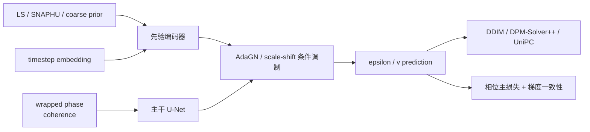
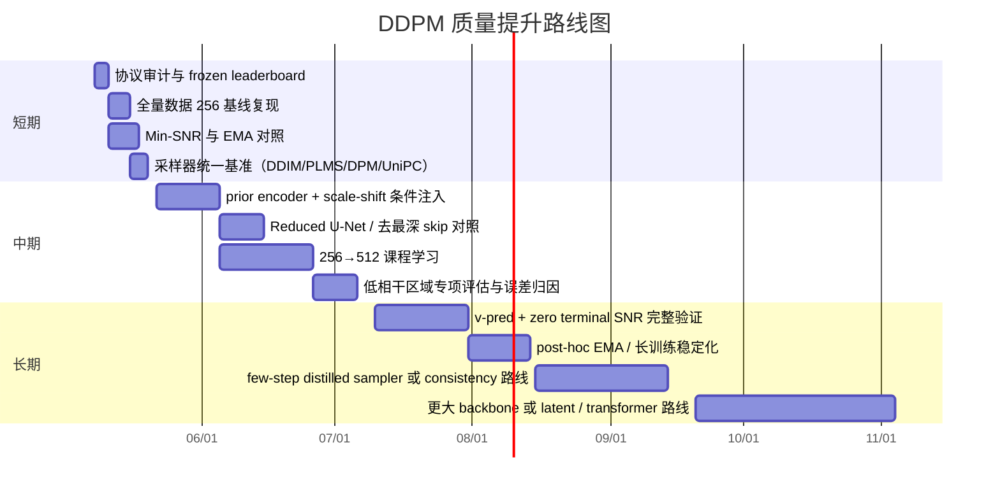

# 提升 DDPM 模型质量的深度研究报告

## 执行摘要

从你上传的实验记录看，当前最有价值的结论并不是“换一个采样器”，而是三点更根本的判断。第一，现有记录里至少有两处协议不一致：项目概述写“验证集 80 样本”，实验环境又写 `val=564`；实验 1 的 DDPM 200 步 `Masked MAE=8.33`，而实验 2 的 DDPM 200 步又写成 `6.32`。这意味着**先冻结评估协议和 checkpoint 命名规则**，比直接继续堆新技巧更重要。第二，你目前真正摸到的主瓶颈是**数据量与分辨率**：记录里只明确训练了 300 个样本，而完整训练集是 2725；128→256 是唯一带来稳定收益的单项改动，`Masked MAE` 从 8.33 降到 7.55，说明模型首先缺的是空间上下文而不是采样步数。第三，文献与官方实现共同指向一条更高 ROI 的路线：**全量数据/更高分辨率课程学习 → Min-SNR 或类似重加权训练 → EMA → 更合理的条件注入方式 → 再去做更快采样**。其中，Min-SNR 能缓解不同时间步的优化冲突并显著加速收敛；zero-terminal-SNR 与 `v_prediction` 可以修正训练/采样末端不一致；EDM2 进一步说明 EMA 长度和训练动力学会显著影响最终 FID；而最新 InSAR 相位解缠工作又提示，在这个领域里，**简单而稳的 U-Net 往往比更重的注意力模型更有效**。fileciteturn0file0 citeturn1search0turn4search2turn22search0turn15search1turn13view0

如果目标是“让 DDPM 真实追近甚至超过当前 U-Net 基线”，我建议把近期目标设成：先在**统一评估协议**下，把当前最佳 `Masked MAE=7.55` 再压低 **0.5–1.0 rad**；更现实的实现路径不是采样器单独优化，而是把训练数据从 300 提升到 1000 再到全量 2725，加入 EMA 与时间步重加权，并把 `coarse` 先验从“直接拼接或残差目标”改成“独立先验分支 + 归一化调制”的条件方式。对你的任务，采样器大概率主要贡献**推理速度**，而不是首要的质量提升。fileciteturn0file0 citeturn3search2turn19search0turn13view0turn29view0

## 实验记录复盘与当前配置

你当前记录里已经有几个非常清晰、而且比很多“再加一个 trick”更重要的事实。其一，**数据利用率偏低**：基线实验明确只用了 300 个训练样本，而记录中的完整训练集规模是 2725，这意味着你目前仅用到了大约 **11%** 的训练数据。其二，**中心裁剪代价很大**：128×128 配置相当于把 512×512 patch 中的大部分上下文丢掉，记录也明确指出 128 裁剪会丢失 93.75% 像素。其三，**DDIM 已经证明采样不是主瓶颈**：从 200 步降到 5 步几乎不掉质量，说明这个任务本质更接近确定性逆问题，采样器优化优先级应排在训练质量之后。其四，**“直接加更多条件通道”与“改做残差预测”都没有产生实质收益**，这并不意味着先验没用，而是意味着“简单拼接”和“弱残差作为扩散目标”这两种具体做法不对。fileciteturn0file0

目前环境只明确到了 entity["software","PyTorch","machine learning framework"] 2.11.0+cu126，与 entity["software","CUDA","parallel computing platform"] 12.6；**GPU 型号、显存大小、EMA 设置、优化器 betas、权重衰减、损失具体形式、256 实验是否沿用了 300 子集或全部训练集**，都没有被完整写入记录。为了避免伪精确，下面的“当前配置”表格里，我把凡是记录没有显式确认的项目一律标为“未指定”，不擅自继承实验 1。fileciteturn0file0

| 维度 | 实验记录中的当前值 | 明确性 | 推荐修改项 |
|---|---|---|---|
| 数据集与划分 | `taskbook_merged`；环境部分写 `train=2725, val=564, test=550`；项目概述又写“验证集 80 样本” | **记录冲突** | 先冻结单一 `split.yaml`；主报告统一用 `train=2725, val=564, test=550`，80 张只作为快速 smoke test |
| 预处理 | 128 实验明确为 `512→128` 中心裁剪；256 实验只明确“分辨率 256”，裁剪方式与归一化未重述 | 部分未指定 | 用随机裁剪替代中心裁剪；做 `256→512` 课程学习；显式记录输入/输出归一化与 mask 处理 |
| 输入条件 | 3 通道：`sin(wrapped), cos(wrapped), coherence)` | 明确 | 保留这 3 个主通道；`coarse/LS/SNAPHU` 不再直接拼接到主干，而改成独立先验编码器 |
| 额外条件增强 | 7 通道方案（加 `coarse`, gradient_x/y, mask`）无增益 | 明确 | 先不用继续堆通道；改测试 `prior encoder + AdaGN/scale-shift` 条件注入 |
| 输出目标 | `unwrapped phase`；残差目标试验失败 | 明确 | 继续以主目标预测 `x0 / ε / v` 为主；若做残差，只做“高频残差细化”而非全量残差 |
| 模型架构 | U-Net：`64 base, [1,2,4] mults, 2 resblocks`；128 时 `attn@16`，256 时 `attn@32` | 部分明确 | 先测更稳的 4 级 U-Net：`base=64/96, mults=[1,2,4,8]`；`resblock_updown=True`；条件层改 `scale-shift norm`；增加“去最深 skip”对照 |
| 时间步数 T | `T=200` | 明确 | 先保留 `T=200` 做控制；二阶段再测 `T=400` 或 `T=1000`，但要与 `v_prediction/zero-SNR` 联动，不建议孤立增加 |
| 噪声调度 | 线性 `β=1e-4→0.02`；余弦调度在当前设置下无效果 | 明确 | 先不盲目换纯 cosine；优先测试 `zero-terminal-SNR + v_prediction` 或 EDM 风格 sigma 设计 |
| 损失函数形式 | 基线损失未明确；只明确“mask-aware loss 无效” | **未指定** | 显式落盘：`simple ε-MSE` 基线；再做 `Min-SNR γ=5`；二阶段测试 `v_prediction`；对相位任务可极小权重加入梯度一致性项 |
| 优化器 | `AdamW lr=1e-4, CosineAnnealingLR` | 部分明确 | 先保留 AdamW 与 `lr=1e-4`；补充 `betas=(0.9,0.999)`、`eps=1e-8`、`grad clip=1.0`、warmup 1000–3000 steps |
| Batch size | 128 时 8；256 时 4；AMP 已开启 | 明确 | 保持 micro-batch 4；用梯度累积把 global batch 提到 16 或 32 |
| 训练时长 | 128 时 12 min；256 时 25 min | 部分明确 | 以后统一记录“steps / epoch / GPU hours / samples seen”而不是只写 wall-clock |
| 训练轮数 | 基线 80 epoch；256 当前最佳是否仍为 80 epoch **未指定** | 部分未指定 | 至少测 `80 / 120 / 160 epoch` 或固定步数 `50k / 100k / 150k` |
| EMA | **未指定** | 未指定 | 必加；首选 `ema_max_decay=0.9999`；算力允许时再做 post-hoc EMA |
| 采样方法 | 当前最佳：`DDIM-50` 默认；DDPM 200 与 DDIM 5–200 质量近似 | 明确 | 继续保留 `DDIM-50` 作为基准；新增 `DPM-Solver++-20`、`UniPC-20`、`PLMS/PNDM-20` 对照 |
| 硬件 | 只写到 `CUDA 12.6`；GPU 型号未写 | **未指定** | 以后每个实验强制记录 GPU 型号、显存、AMP/bf16/fp16、吞吐 `it/s` |

上表的推荐修改并不是“把所有新技巧一次性全上”，而是把你的实验空间收敛成**几条真正有希望的主线**：协议统一、数据与分辨率、训练目标与时间步权重、先验注入方式、以及 EMA 与采样器。相关依据来自你自己的实验记录，以及近几年被反复验证过的主线扩散工作。fileciteturn0file0 citeturn1search0turn4search2turn22search0turn3search2turn19search0turn13view0turn15search1



这张示意图对应的核心思想是：**不要再把 coarse 结果当作“直接残差目标”或“简单拼接通道”处理，而应把它当作可调制的先验**。这和最新的 InSAR 条件扩散工作思路一致，也与 ADM / guided-diffusion 一类通过 scale-shift norm 融合条件的做法更接近。citeturn13view0turn26view0

## 文献与实现调研

近三年里，对“提升扩散模型质量”的研究基本收敛到了几条主干：更合理的噪声/时间步权重、更稳定的网络与归一化设计、条件注入方式、EMA 与训练动力学、以及更高阶的训练后采样器。对你的任务，这些方法不能机械照搬，因为相位解缠是**强条件、低多样性、近确定性的逆问题**；但它们仍然提供了非常强的工程启发。更重要的是，最新 InSAR 与相位重建文献已经开始给出“哪些技巧在相位任务里真的有用”的证据。citeturn1search0turn4search2turn22search0turn13view0turn15search1turn29view0

| 技术方向 | 最适合你任务的复现版本 | 原理 | 官方论文 / 实现入口 | 预期收益 | 潜在缺点 |
|---|---|---|---|---|---|
| 时间步重加权 | **Min-SNR γ=5** 先上 | 把不同时间步视为冲突的多任务，抑制低收益时间步主导训练 | urlEfficient Diffusion Training via Min-SNR Weighting Strategyturn1search0；urlTiankaiHang/Min-SNR-Diffusion-Trainingturn1search1 | 收敛更快，通常也更稳 | γ 过大可能让低噪时间步学习不足 |
| 末端调度修正 | **zero-terminal-SNR + v_prediction** | 修正训练/推理在最后时间步不一致的问题 | urlCommon Diffusion Noise Schedules and Sample Steps are Flawedturn4search2；urlDiffusers scheduler docsturn25search3 | 对采样末端更一致，少步采样更稳 | 需要训练目标、采样器参数一起切换 |
| 反向方差学习 | `learn_sigma=True` + hybrid/simple 对照 | 改善反向过程方差建模，通常能在更少步数下保留质量 | urlImproved DDPM 论文turn0search9；urlopenai/improved-diffusionturn17search3 | 对 few-step 采样更友好 | 训练目标更复杂，早期调参成本上升 |
| 结构稳健化 | `resblock_updown + scale-shift norm`；少量注意力 | 改善上下采样与条件融合的稳定性 | urlopenai/guided-diffusionturn7search2 | 对条件注入和深层训练更稳 | 不一定立刻带来大幅 MAE 改善 |
| 条件先验 | **coarse 先验独立编码器**，不要直接残差目标 | 先验负责全局一致性，扩散负责局部纠错 | urlUnwrapDiff 论文turn12search2 | 对低相干/大梯度区域最有希望 | 先验过强时模型可能只学复制 coarse |
| 高频细化 | **去最深 skip / 频率解耦** | 抑制高频 shortcut，让网络先学低频结构，再由扩散补细节 | urlDiffPR 论文turn30search1 | 对相位类任务的锐利边界与细节恢复有启发 | 这是跨领域证据，不是 InSAR 直接结论 |
| 采样器 | `DDIM-50` 基线；`DPM-Solver++-20` 与 `UniPC-20` 对照 | 更高阶数值积分，在少步下更稳 | urlDPM-Solver 论文turn3search2；urlLuChengTHU/dpm-solverturn3search3；urlUniPC 论文turn19search0 | 主要降推理延迟，也可能改善 few-step 质量 | 若 prediction type / variance 设置不匹配会不稳 |
| EMA 与后处理 | **EMA 0.9999**；后续可试 post-hoc EMA | 权重平均通常能显著改善生成质量与泛化 | urlAnalyzing and Improving the Training Dynamics of Diffusion Modelsturn22search0；urlNVlabs/edm2turn10search1 | 低成本高收益，优先级很高 | 需要额外存储，且最优 decay 与训练时长耦合 |
| CFG / 条件 dropout | 小尺度 `cfg_scale=1.2–2.0` 作为可选项 | 质量与条件一致性之间做后验调节 | urlClassifier-Free Diffusion Guidanceturn4search0 | 对边缘与局部细节可能有帮助 | 你的任务近确定性，scale 过大易过拟合条件 |
| 大模型替换 | DiT / latent diffusion 仅放长期 | 更强可扩展性，适合大数据大算力 | urlScalable Diffusion Models with Transformersturn2search0；urlfacebookresearch/DiTturn2search12；urlHigh-Resolution Image Synthesis with Latent Diffusion Modelsturn20search1 | 大规模时可能继续降 FID | 对你当前数据规模与物理任务，不是近期最优先 |

### 噪声调度与目标参数化

对你最值得优先复现的组合，不是“单独把线性 schedule 改成余弦”，而是把**时间步权重、目标参数化、采样末端一致性**视作一个整体。`Improved DDPM` 证明了学习反向方差与改进 schedule 可以在更少采样步数下保持质量；`Min-SNR` 则指出扩散训练本质上是多时间步间存在冲突的多任务优化，使用 clamped SNR 权重能显著加快收敛；`Common Diffusion Noise Schedules…` 又进一步指出，很多常见实现并没有真正让最后一步达到零 SNR，因此训练看到的“最后一步”与采样开始时的纯噪声并不一致。对你这种相位逆问题，我更建议先做两条有控制变量的路线：一条保留 `ε-pred + T=200 + linear`，只加 `Min-SNR`；另一条切到 `v-pred + zero-terminal-SNR`，并确保采样器从最后时间步开始。这样你就能把“重加权收益”和“末端一致性收益”拆开验证。citeturn0search9turn1search0turn4search2turn25search3

记录里“余弦噪声调度无效”的结论并不和上述文献冲突。更准确地说，那次实验把**7 通道条件增强、余弦 schedule、mask-aware loss**绑在了一起，而且仍是在当前较弱训练设置下完成；因此它只能证明“这个组合在当时的配置下无效”，尚不能排除 `v_prediction + zero-terminal-SNR` 或 `Min-SNR` 在更规范设置下有效。fileciteturn0file0

### 网络结构与条件注入

从通用扩散文献看，ADM/guided-diffusion 一支的实用经验非常直接：`resblock_updown`、`scale-shift norm`、多分辨率少量注意力，已经在高质量像素空间扩散里被反复验证。DiT 则说明，在大规模数据和算力下，模型容量上升与更好 FID 高度相关。可问题是，你的任务不是普通自然图像生成，而是 InSAR 相位解缠。最新的 InSAR 专项工作反而给出非常强的反例：在一个全球 LiCSAR 基准上，**vanilla U-Net 比 attention-heavy 模型高 34% 的 R²、推理还快 2.5×**。因此，你这里的结构优化重点不应是“一步换成 DiT”，而应是**把现有 U-Net 改成更稳的条件 U-Net**：增加一个尺度、使用更稳的上下采样残差块、把条件从“拼接输入”改成“调制中间特征”。citeturn26view0turn28view0turn15search1

更有意思的是，2025 年的相位重建工作 `DiffPR` 发现：对相位类任务，**去掉最深层 skip connection**，先让网络学低频主体，再由扩散模块补高频，反而可能更好。这和你的残差预测失败并不矛盾。你的失败是“让扩散直接学一个弱的全图残差”；DiffPR 的思路则是“用确定性网络先输出稳定的低频结构，再让扩散只做高频细化”。对 InSAR 相位，这启发了一个非常值得做的架构对照：**标准 U-Net vs 去最深 skip 的 Reduced U-Net vs Reduced U-Net + diffusion refinement**。citeturn29view0turn30search1

### 条件生成与先验使用

你的实验 3 和实验 4 很容易让人误判成“coarse 先验没用”。我不这么看。更合理的解读是：**coarse 先验作为额外输入通道或全量残差目标，并不是好用法**。2025 年的 `UnwrapDiff` 直接把 SNAPHU 输出作为条件先验，引入到 U-Net 里，而不是把整个任务改写成“预测 coarse 的残差”；在他们的设置里，这样的条件先验能把 NRMSE 在相对 SNAPHU 上再降 10.11%。这和你记录里“LS coarse 与 unwrapped 高度相关，不提供额外信息”的现象并不冲突，因为“高相关但无新增信息”只针对**直接拼接进入主输入**的设计。对这类先验，更合适的办法是：先用一个小型 encoder 把 coarse 提炼成全局一致性特征，再通过 AdaGN / FiLM / scale-shift 方式调制主干。citeturn13view0turn12search2

如果你想把条件生成再往前推进一步，可以测试**小尺度的 classifier-free guidance**。做法不是文本 CFG 那样用大 scale，而是在训练时对先验分支做 10%–20% 的条件 dropout，使模型兼容“有先验”和“弱先验/无先验”两种模式；推理时从 `cfg_scale=1.2` 或 `1.5` 开始，而不是直接用大于 3 的 scale。对你这种近确定性映射，CFG 更像“后验 sharpen”而不是“多样性换质量”的大旋钮，所以规模必须小。citeturn4search0

### 采样器、EMA 与训练稳定性

你的记录已经证明：DDIM 在 5–200 步范围内几乎不掉质量，因此**继续把 DDPM 的 200 步缩成 20 步并不会自动提升质量**，它主要提升的是推理速度。此时最有性价比的做法是把 DDIM-50 作为现有质量基准，然后在同一个 checkpoint 上测试 PLMS/PNDM、DPM-Solver++ 和 UniPC。按照这些方法的论文与官方实现，它们在 10–20 步区间通常比一阶 DDIM 更稳，尤其是在少步 regime 下。对你的任务，我对它们的预期是“**同质量更快**”或“**轻微提升 few-step 稳定性**”，而不是主导 MAE 的下降。fileciteturn0file0 citeturn3search0turn3search2turn19search0

真正容易被低估的是 EMA。EDM2 那篇工作最大的工程启示之一就是：**训练动力学和 EMA 长度本身就是可优化对象**，并且会显著影响最终 FID。你当前记录里没有明确 EMA，这意味着你大概率还没吃到这个“低成本高收益”的改动。对当前阶段，我会把 EMA 放到和“全量数据训练”同一优先级，而把“换更复杂 backbone”排在后面。citeturn22search0turn10search1

## 可复现实验设计

在正式做 ablation 之前，我建议先建立一个**冻结评估协议**：固定 `split.yaml`、固定 3 个随机种子、固定输出渲染与指标实现、固定 checkpoint 命名。否则你记录里已经出现的两类不一致——验证集规模与 DDPM 200 步 MAE——会让后续所有结论都变弱。fileciteturn0file0

对这个任务，评估指标不应只看 FID/IS。更合理的做法是把指标分成两层：**相位域主指标**与**生成域辅指标**。主指标保留你当前已经在用的 `Masked MAE / RMSE / Grad MAE / WinRate`，并新增 `wrapped residual MAE` 与 `residue count`；辅指标则在三通道渲染 `[(sin φ), (cos φ), coherence]` 上计算 `LPIPS`、`FID` 和 `precision/recall`。这样既保留了扩散文献里通行的质量度量，也避免把原始 unwrapped phase 直接硬塞进 Inception 特征空间。`LPIPS` 来自深特征感知距离，`precision/recall` 能把“质量”和“覆盖”拆开，`clean-fid` 则专门解决不同 FID 实现之间不可比的问题。`IS` 可以继续报，但在你的任务里我建议把它降级为**附录指标**。citeturn6search0turn6search1turn6search2

以下 GPU 小时预算按你记录里的“256×256 训练 25 分钟”做线性外推；由于 GPU 型号未指定，这些数字更适合当作**相对预算**而不是绝对承诺。fileciteturn0file0

| 实验组 | 控制变量与对照 | 具体超参 | 预算 | 评估指标 | 显著性检验 |
|---|---|---|---|---|---|
| 数据规模与训练时长 | 固定现有 256×256、3ch、U-Net64、T=200、DDIM-50；只改训练样本与 epoch | A0: 300 样本, 80 ep；A1: 1000 样本, 80 ep；A2: 2725 样本, 80 ep；A3: 2725 样本, 160 ep | 约 0.4 / 1.4 / 3.8 / 7.6 GPUh | Masked MAE、RMSE、Grad MAE、WinRate、LPIPS、FID(rendered)、P/R | 每组 3 seeds；对 per-patch 指标做 paired bootstrap 10,000 次与 Wilcoxon signed-rank；多比较用 Holm 校正 |
| 目标参数化与重加权 | 固定 1000 或 2725 样本、256×256、相同 backbone；只改损失与 schedule | B0: `ε-MSE`；B1: `ε-MSE + Min-SNR(γ=5)`；B2: `v-pred + zero-terminal-SNR`；B3: `v-pred + zero-terminal-SNR + Min-SNR` | 约 1.4–4.5 GPUh / 组 | 同上，外加 per-timestep loss 曲线、收敛速度（best val step） | 比较最佳 val checkpoint 与最后 checkpoint；报告均值、标准差、95% CI |
| 结构与条件注入 | 固定数据规模、schedule 与优化器；只改先验使用方式 | C0: 3ch baseline；C1: 3ch + coarse 直接拼接；C2: 3ch + prior encoder + scale-shift；C3: Reduced U-Net（去最深 skip）+ prior encoder | 约 4–8 GPUh / 组 | 主指标 + residue count；低相干区域单独统计；误差热图分层 | 按 coherence 分桶做分层 bootstrap；重点看低相干/高梯度子集 |
| 采样器与步数 | 固定最佳训练 checkpoint；只改 sampler 与步数 | D0: DDIM-50；D1: DDIM-20；D2: PLMS/PNDM-20；D3: DPM-Solver++-20；D4: UniPC-20；D5: DPM-Solver++-10 | 仅推理预算，通常 0.2–0.5 GPUh 即可完成 | 质量指标 + latency / sample + memory peak | 对相同 test set 与相同 seed 做 paired 比较；重点报告质量-时延 Pareto |
| 分辨率课程学习 | 固定最佳目标参数化；只改训练分辨率策略 | E0: 全程 256；E1: 256 80ep + 512 40ep 微调；E2: 256 随机裁剪 + 512 tiled finetune | 约 4 / 10 / 12–18 GPUh | 主指标、边界区域 Grad MAE、tile seam error | 对边界区域单独 bootstrap；可视化 seam failure cases |

如果只选三组，我建议优先做 **A + B + C**。A 组回答“你是不是单纯没把数据吃满”；B 组回答“扩散目标本身是不是没配对”；C 组回答“先验到底有没有用，只是你之前用错了方式”。D 组应该放在这三组之后，因为它更像部署优化而不是质量瓶颈突破。fileciteturn0file0 citeturn1search0turn4search2turn13view0turn29view0

## 实施步骤与时间表

短期目标应该以“把结论变可信”为先，中期目标再把 `Masked MAE` 往下压，长期目标再考虑更大模型、蒸馏或 latent 方案。这个顺序和你当前记录非常匹配：因为现在你最缺的不是方法名，而是**可比较、可复现、可定位失败点的实验面板**。fileciteturn0file0



对应到里程碑，我会这样定义。**短期**的成功标准是：统一协议后能稳定复现“256×256 + DDIM-50”的基线，并给出 3 个种子的均值与置信区间；同时确认 EMA 和 Min-SNR 是否在你的任务上立刻有效。**中期**的成功标准是：明确“coarse 先验有用，但必须通过调制式条件注入”这一点，并把 256→512 课程学习跑通。**长期**才是把 `v_prediction`、post-hoc EMA、蒸馏和更大 backbone 纳入统一框架。citeturn22search0turn13view0turn29view0

## 结果预期与风险评估

下面的量化区间不是论文原数值直接照搬，而是**结合你的当前记录与文献结论后的工程预估**。它们的意义是帮你排序优先级，而不是替代实验。fileciteturn0file0 citeturn1search0turn13view0turn15search1turn29view0

| 改进项 | 对你任务的量化预期 | 最可能的失败模式 | 调试建议 |
|---|---|---|---|
| 数据从 300 扩到 1000 / 2725 | `Masked MAE` 再降 **8%–15%**；方差下降明显 | synthetic/real 分布失衡；长训练后偏向某一类场景 | 记录 real/synth 分层指标；做 stratified sampler；分别看 real-only 和 synthetic-only val |
| 256→512 课程学习 | 在 256 最佳基础上再降 **5%–12%**，尤其是 `Grad MAE` | OOM、tile seam、训练震荡 | 用 random crop 预热；再做 512 微调；开启 grad checkpoint；边界区域单独看误差 |
| EMA 0.9999 | 通常能带来 **2%–6%** 的主指标收益，且更稳 | 最优 decay 与训练时长不匹配；EMA 模型过“钝” | 同时保存 raw 与 EMA checkpoint；对比 best-val 而不是只看 last |
| Min-SNR γ=5 | 收敛更快，最终 `Masked MAE` 预期降 **3%–8%** | γ 不合适，导致低噪区学习不足 | 网格搜 `γ ∈ {3,5,7}`；画 per-timestep loss 曲线 |
| `v-pred + zero-SNR` | **0%–5%** 的额外质量收益，更可能体现为 few-step 稳定性与末端一致性 | 训练目标、采样器配置不同步 | 保证 scheduler 与 prediction type 同时切换；从 `DDIM-50` 开始，不先上超少步 |
| prior encoder + scale-shift 条件注入 | 在低相干/大梯度测试子集上，主指标有望降 **5%–10%** | 模型完全忽略先验；或过度依赖先验，退化成复制 LS | 加“无先验 / 弱先验 / 真先验”三路对照；看 attention/feature norm 与 ablation |
| 去最深 skip / 频率解耦 | 主指标降 **2%–6%**，边缘和纹理更锐利 | 低层细节回传不足，出现模糊块 | 只去最深一级 skip，不要一次去掉所有 skip；看 Grad MAE 和 residue count |
| DPM-Solver++ / UniPC | 质量通常持平或略好，推理加速 **2×–5×** | 与 `ε/v/x0` 预测类型不匹配，few-step 反而抖动 | 固定同一 checkpoint；先从 20 步测，再测 10 步 |

我对失败模式的判断有一个很明确的倾向：你最可能遇到的，不是“模型太小”，而是**训练配置与任务形式不匹配**。例如，残差预测失败本质上不是因为残差思想一定错，而是因为“全图弱残差 + 标准高噪扩散目标”这对组合不匹配；同理，7 通道增强失败也不等于先验无用，而是说明“直接拼输入”不够。`UnwrapDiff` 的结果正好说明：把传统优化输出作为**条件引导**而不是直接替代目标，是更稳的设计。fileciteturn0file0 citeturn13view0

另一个容易低估的风险是**评估指标错位**。如果你直接在原始 unwrapped phase 上算 FID/IS，结果很可能不稳定且不具解释力，因为 Inception 特征并不是为单通道相位场设计的。更合理的做法是把相位映射到 `sin/cos` 周期表示，并与 coherence 组合成 3 通道渲染，再计算 LPIPS/FID/P&R；与此同时，把真正的结论仍然建立在相位域 MAE、RMSE、梯度误差和 residue 统计上。citeturn6search0turn6search1turn6search2

## 代码与复现资源

如果你希望“最少改代码、最快开始”，我建议以 `urlopenai/improved-diffusionturn17search3` 或 `urlopenai/guided-diffusionturn7search2` 作为**训练主干**，以 `urlhuggingface/diffusersturn7search0` 作为**scheduler 与工程脚手架**，以 `urlLuChengTHU/dpm-solverturn3search3` 和 `urlwl-zhao/UniPCturn19search12` 作为**推理加速器**，再从 `urlNVlabs/edm2turn10search1` 借鉴 EMA 与训练动力学处理。对你的任务，如果只想快速做相位任务原型，那么 `urllucidrains/denoising-diffusion-pytorchturn7search1` 的最小工程量也很有价值。citeturn17search3turn7search2turn7search0turn3search3turn19search12turn10search1turn7search1

| 资源 | 适用角色 | 对你最有价值的部分 | 入口 |
|---|---|---|---|
| OpenAI improved diffusion | 训练基线 | `learn_sigma`、simple/KL loss、标准 DDPM 训练框架 | urlopenai/improved-diffusionturn17search3 |
| OpenAI guided diffusion | 结构参考 | `resblock_updown`、`use_scale_shift_norm`、attention 分辨率经验 | urlopenai/guided-diffusionturn7search2 |
| Diffusers | 工程脚手架 | scheduler 切换、EMA 辅助、训练脚本模板 | urlhuggingface/diffusersturn7search0 |
| Min-SNR official repo | 损失重加权 | 直接复现 `γ` 权重策略 | urlTiankaiHang/Min-SNR-Diffusion-Trainingturn1search1 |
| DPM-Solver | 采样加速 | 10–20 步高阶采样 | urlLuChengTHU/dpm-solverturn3search3 |
| UniPC | 采样加速 | 极少步 regime 的 predictor-corrector | urlwl-zhao/UniPCturn19search12 |
| PNDM / PLMS | 采样对照 | PLMS 是你最容易加入的经典 multistep 对照 | urlluping-liu/PNDMturn3search1 |
| EDM / EDM2 | 稳定训练 | 预条件化、EMA、训练动力学 | urlNVlabs/edmturn0search12；urlNVlabs/edm2turn10search1 |
| DiT | 长期路线 | 当数据与算力都放大时的 transformer baseline | urlfacebookresearch/DiTturn2search12 |
| latent diffusion | 长期路线 | 若以后做更高分辨率或更大 patch，可参考 latent 化 | urlCompVis/latent-diffusionturn20search3 |

下面三段代码足够你快速上手最关键的三个改动：Min-SNR、`v_prediction + zero-SNR`、以及调制式先验注入。

```python
import torch
import torch.nn.functional as F

def compute_snr(alphas_cumprod: torch.Tensor, timesteps: torch.Tensor) -> torch.Tensor:
    alpha_bar = alphas_cumprod[timesteps].float()
    snr = alpha_bar / (1.0 - alpha_bar).clamp_min(1e-8)
    return snr

def min_snr_weighted_eps_loss(
    pred_eps: torch.Tensor,
    true_eps: torch.Tensor,
    alphas_cumprod: torch.Tensor,
    timesteps: torch.Tensor,
    gamma: float = 5.0,
) -> torch.Tensor:
    snr = compute_snr(alphas_cumprod, timesteps)
    weights = torch.minimum(snr, torch.full_like(snr, gamma)) / snr.clamp_min(1e-8)
    loss = F.mse_loss(pred_eps, true_eps, reduction="none").mean(dim=(1, 2, 3))
    return (weights * loss).mean()
```

这段是你最该优先实现的版本，因为它不要求你先整体迁移到新框架，改动面小，而且与 2023 年以后的主流扩散训练改进非常一致。citeturn1search0turn1search1

```python
def get_v_target(x0: torch.Tensor, noise: torch.Tensor, alpha_bar_t: torch.Tensor) -> torch.Tensor:
    # alpha_bar_t shape: [B, 1, 1, 1]
    return alpha_bar_t.sqrt() * noise - (1.0 - alpha_bar_t).sqrt() * x0

def min_snr_weighted_v_loss(
    pred_v: torch.Tensor,
    true_v: torch.Tensor,
    alphas_cumprod: torch.Tensor,
    timesteps: torch.Tensor,
    gamma: float = 5.0,
) -> torch.Tensor:
    snr = compute_snr(alphas_cumprod, timesteps)
    weights = torch.minimum(snr, torch.full_like(snr, gamma)) / (snr + 1.0)
    loss = F.mse_loss(pred_v, true_v, reduction="none").mean(dim=(1, 2, 3))
    return (weights * loss).mean()

# sampling-side config idea
scheduler_cfg = {
    "prediction_type": "v_prediction",
    "rescale_betas_zero_snr": True,
    "timestep_spacing": "trailing",
}
```

如果你切到 `v_prediction`，采样端一定要同步改 scheduler，否则你会得到“训练目标换了、采样假设没换”的伪退化。citeturn4search2turn25search3turn25search8

```python
import torch.nn as nn

class PriorFiLM(nn.Module):
    def __init__(self, prior_ch: int, emb_ch: int, feat_ch: int):
        super().__init__()
        self.prior_encoder = nn.Sequential(
            nn.Conv2d(prior_ch, feat_ch, 3, padding=1),
            nn.SiLU(),
            nn.Conv2d(feat_ch, feat_ch, 3, padding=1),
            nn.SiLU(),
        )
        self.to_scale_shift = nn.Sequential(
            nn.AdaptiveAvgPool2d(1),
            nn.Conv2d(feat_ch, 2 * emb_ch, 1),
        )

    def forward(self, prior: torch.Tensor):
        feat = self.prior_encoder(prior)
        scale_shift = self.to_scale_shift(feat)  # [B, 2*emb_ch, 1, 1]
        scale, shift = scale_shift.chunk(2, dim=1)
        return scale, shift


class AdaGNBlock(nn.Module):
    def __init__(self, channels: int, emb_ch: int, groups: int = 32):
        super().__init__()
        self.norm = nn.GroupNorm(groups, channels, affine=False)
        self.proj = nn.Conv2d(channels, channels, 3, padding=1)
        self.emb = nn.Linear(emb_ch, channels * 2)

    def forward(self, x: torch.Tensor, t_emb: torch.Tensor, prior_scale: torch.Tensor, prior_shift: torch.Tensor):
        h = self.norm(x)
        t_scale, t_shift = self.emb(t_emb).chunk(2, dim=-1)
        t_scale = t_scale[..., None, None]
        t_shift = t_shift[..., None, None]
        h = h * (1 + t_scale + prior_scale) + (t_shift + prior_shift)
        return self.proj(torch.nn.functional.silu(h))
```

这段伪代码代表的不是唯一实现，而是你后续应该优先验证的条件注入思路：**coarse 先验先被编码成“调制信号”，再去影响主干特征归一化**，而不是继续把它当作普通图像通道堆在输入端。这个思路更接近 `UnwrapDiff` 的“先验引导 + 扩散纠错”，也与 ADM 风格的 `scale-shift norm` 一致。citeturn13view0turn26view0

最后，评价脚本建议统一加入下面这一步，把相位转成更适合感知指标与 FID 的三通道表示：

```python
def render_phase_for_metrics(phi, coherence):
    # phi: [B, 1, H, W]
    return torch.cat([torch.sin(phi), torch.cos(phi), coherence], dim=1)
```

这样做不是为了“美观”，而是为了让周期相位在特征空间里更可比较；否则 `π` 和 `-π` 这种本应相邻的状态，会在原始标量空间里被错误地看成遥远。配合 `clean-fid`、`LPIPS` 和 `precision/recall`，它会比直接在原始相位图上计算生成指标更稳。citeturn6search0turn6search1turn6search2